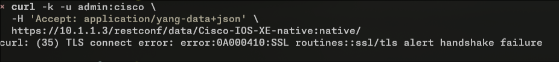

# todo:

## r1:
* no shut på serial

* kolla om ip summary-address eigrp 1 192.168.48.0 255.255.254.0 går att fixa annars försök fixa genom cli om det är ok

* kolla om det är ok att rätta ovanstående med en show run | i ip summary-address 

## r2:
* no shut på serial

## r3:
* testa allting

* [ !! :( jätteledsen
